# ER Diagram

# Goal (ER Diagram):

# Colors:

- light-100
- light-200
- light-300
- light-400
- dark-500
- dark-700
- dark-900
- green
- red
- orange

# Todo:

[] Admin Panel
[] Add Review (in My Orders, allow only if user has received the product)
[] Add Image Upload using AWS S3
[] Add table for top animation bar

# Features

### 🧑‍💼 User & Authentication

User registration with email and phone verification

OAuth provider support (Google, GitHub, etc.)

Secure session management

Role-based users (admin / customer)

Guest checkout support

Address book with default shipping & billing addresses

### 🛍️ Product Catalog

Hierarchical categories (parent–child structure)

Brand management

Product collections (featured, seasonal, curated lists)

Product variants with size & color support

Variant-level pricing, stock, and limits

Product & variant image management

SEO-ready fields (slug, meta title, meta description)

Product visibility controls (publish, feature, activate)

### 🧺 Cart & Wishlist

Persistent carts for users and guests

Automatic cart linking on login

Cart item quantity management

Wishlist support for saved products

Abandoned cart tracking for recovery workflows

### 📦 Orders & Checkout

Complete order lifecycle management

Order status tracking with full history

Shipping & billing address snapshotting

Order item snapshot (price, SKU, image, product details)

Coupon and discount application

Customer notes and admin notes

Shipment tracking and delivery timestamps

### 💳 Payments & Refunds

Multiple payment methods support

Payment gateway integration ready

Payment failure tracking and debugging

Refund processing with audit trail

Partial and full refunds supported

Gateway response logging for reconciliation

### 🧮 Inventory Management

Variant-level stock control

Inventory transaction ledger (additions, deductions, adjustments)

Low-stock alerts and thresholds

Order-linked inventory deductions

Manual admin stock corrections with audit logs

### 🎟️ Coupons & Promotions

Fixed and percentage-based discounts

Validity windows and usage limits

Per-user and global usage tracking

Category and product-level applicability

Coupon abuse prevention via usage history

### ⭐ Reviews & Ratings

Product reviews with ratings

Verified purchase enforcement

Review moderation support

Helpful vote tracking

Review statistics stored on products

### 🔔 Notifications

User notification system

Read/unread tracking

Actionable notifications (links to orders, products, etc.)

### 📊 Analytics & Tracking

Product and category page view tracking

User and guest activity tracking

Cart abandonment insights

Review and rating aggregation

Order and revenue-ready data model

### 🛡️ Admin & Audit Safety

Full order status change history

Inventory adjustment tracking with actor reference

Refund processing accountability

Payment failure and retry visibility

Clear separation of customer vs admin actions

### ⚙️ Architecture & Scalability

Designed for PostgreSQL with strong relational integrity

Migration-friendly schema (V1 → V2 evolution)

Monolith-friendly but microservice-ready

Snapshot-based orders for historical correctness

Extensible for future features like warehouses, vendors, or subscriptions

### 🚀 Built for Growth

Start simple, scale without rewrites

Suitable for real-world D2C brands

Freelancer and agency-friendly architecture

Production-tested patterns (not tutorial abstractions)

# Claude Suggestions

1. Variant-Based Architecture
   products → product_variants → cart_items/order_items
   Smart. This is correct for furniture/clothing where same product has different colors/sizes/finishes.
2. Guest Carts
   guests ||--o{ carts : has
   Good thinking. Most students forget this. People browse before logging in.
3. Separate Shipping/Billing Addresses
   orders }o--|| addresses : "shipping address"
   orders }o--|| addresses : "billing address"
   Correct. Real e-commerce needs this.
4. Collections
   collections → product_collections
   Nice. "New Arrivals", "Best Sellers", etc. Many students miss this.

🚨 Critical Issues (Will Cause Problems)

1. Missing Order State Machine / Audit Trail
   Your Schema:
   orders {
   enum status
   }
   Problem: No history. Can't answer:

"Who changed order status from PAID to SHIPPED?"
"When was it marked as delivered?"
"Why was it cancelled?"

Fix - Add:
order_status_history {
uuid id PK
uuid order_id FK
enum from_status
enum to_status
text notes
text changed_by
timestamp changed_at
}
This is CRITICAL for:

Debugging customer complaints
Fraud detection
Admin accountability
Legal compliance

2. Payment Handling is Incomplete
   Your Schema:
   payments {
   uuid order_id FK
   enum method
   enum status
   text transaction_id
   }
   Missing:

Payment gateway ID (Razorpay/CCAvenue payment_id)
Signature verification field
Refund tracking
Webhook reconciliation data

Fix:
payments {
uuid id PK
uuid order_id FK
enum method
enum status
numeric amount
text payment_gateway // 'razorpay', 'ccavenue'
text gateway_payment_id // For webhooks
text gateway_order_id
text signature // For verification
text failure_reason
uuid refund_id FK // Link to refunds table
jsonb gateway_response // Full response for debugging
timestamp paid_at
timestamp created_at
}

refunds {
uuid id PK
uuid payment_id FK
numeric amount
enum status
text reason
text gateway_refund_id
timestamp processed_at
}
Why this matters:

User pays, server crashes → need to reconcile via webhook
Refunds need tracking
Failed payments need reason codes
Gateway responses help debug issues

3.  Cart Has Race Condition Risk
    Your Schema:
    cart_items {
    uuid cart_id FK
    uuid product_variant_id FK
    integer quantity
    }
    Problem: No unique constraint. User could have same item twice in cart.
    Fix:
    cart_items {
    uuid id PK
    uuid cart_id FK
    uuid product_variant_id FK
    integer quantity
    timestamp added_at
    timestamp updated_at

        UNIQUE(cart_id, product_variant_id)  // ← ADD THIS

    }

4.  Order Doesn't Snapshot Product Data
    Your Schema:
    order_items {
    uuid product_variant_id FK
    numeric price_at_purchase
    }
    Problem: What if:

Product name changes?
Variant gets deleted?
Image URL changes?
SKU changes?

Customer's order history shows broken/wrong data.
Fix:
order_items {
uuid id PK
uuid order_id FK
uuid product_variant_id FK // FK for analytics

    // Snapshot at time of purchase
    text product_name
    text variant_sku
    text color_name
    text size_name
    numeric price
    integer quantity
    numeric total
    text image_url
    jsonb full_snapshot           // Complete product data

}
Why: Order history should be immutable. Customer should see what they ACTUALLY bought, not what the product is now.

5. Product Variants Missing Critical Fields
   Your Schema:
   product_variants {
   numeric price
   numeric sale_price
   }
   Missing:

Low stock threshold
Is variant active?
Max quantity per order?

Add:
product_variants {
// ... existing fields
boolean is_active
integer low_stock_threshold
integer max_quantity_per_order
}

6. No Inventory Transaction Log
   Your Schema: Stock is just a number that changes.
   Problem: Can't answer:

"Why did stock go from 10 to 5?"
"Who adjusted inventory?"
"Was this from an order, return, or manual adjustment?"

Add:
inventory_transactions {
uuid id PK
uuid product_variant_id FK
integer quantity_change // +5 or -3
integer quantity_after
enum type // 'SALE', 'RETURN', 'ADJUSTMENT', 'RESTOCK'
text reference_id // order_id or adjustment_id
text notes
text changed_by
timestamp created_at
}
This is "Beyond CRUD" - proper audit trail for business operations.

7. Reviews Missing Verification
   Your Schema:
   reviews {
   uuid product_id FK
   uuid user_id FK
   integer rating
   }
   Missing:

Is this a verified purchase?
Admin approval status?
Helpful votes?

Add:
reviews {
// ... existing
boolean is_verified_purchase
enum status // 'PENDING', 'APPROVED', 'REJECTED'
integer helpful_count
uuid order_id FK // Link to actual purchase
}

8. Coupons Implementation is Incomplete
   Your Schema:
   coupons {
   text code
   enum discount_type
   numeric discount_value
   integer max_usage
   integer used_count
   }
   Missing:

Per-user usage limits
Minimum order value
Expiry dates
Which products/categories it applies to
Track WHO used it

Better:
coupons {
uuid id PK
text code UK
enum discount_type // 'PERCENTAGE', 'FIXED'
numeric discount_value
numeric min_order_value
numeric max_discount // Cap for percentage discounts
integer max_total_usage
integer max_usage_per_user
timestamp valid_from
timestamp valid_until
boolean is_active
}

coupon_usage {
uuid id PK
uuid coupon_id FK
uuid user_id FK
uuid order_id FK
numeric discount_applied
timestamp used_at
}

9. Missing Product Metadata
   Your Schema:
   products {
   text name
   text description
   }
   Add for SEO & Business:
   products {
   // ... existing
   text meta_title
   text meta_description
   boolean is_featured
   integer view_count
   numeric average_rating // Denormalized from reviews
   integer review_count // Denormalized
   timestamp published_at
   }

10. Session Management Over-Engineered
    Your Schema:
    accounts {
    text access_token
    text refresh_token
    timestamp access_token_expires_at
    timestamp refresh_token_expires_at
    }

sessions {
text token
text ip_address
text user_agent
}
This looks like NextAuth schema but...
Questions:

Are you using NextAuth/Auth.js?
If yes: Use their schema exactly
If no: This is way too complex for a furniture store

Simpler approach if building auth yourself:
users {
uuid id PK
text email UK
text password_hash
boolean is_verified
}

sessions {
uuid id PK
uuid user_id FK
text token UK
timestamp expires_at
}
Done. Don't overcomplicate auth.

🤔 Questionable Decisions

1. Genders Table
   Your Schema:
   genders ||--o{ products : has
   For furniture? Why does a sofa have a gender?
   If this is for clothing: Keep it.
   If this is for furniture: Remove it.
   Unless your client sells "masculine chairs" and "feminine tables", this makes no sense.

2. Product → Default Variant
   Your Schema:
   products {
   uuid default_variant_id
   }
   Circular reference alert.
   Problem:

Product references variant
Variant references product
Which do you create first?

Better approach:
product_variants {
boolean is_default
}
Or just make the first variant the default in your application logic.

3. Colors & Sizes as Separate Tables
   Your Schema:
   colors {
   uuid id PK
   text name
   text hex_code
   }

sizes {
uuid id PK
text name
}
For furniture: This might be overkill.
Option A (Your way): Normalize everything

Pro: Easy to filter "show all red products"
Con: More joins, more complexity

Option B (Simpler): Store as text in variants
product_variants {
text color
text size
}

Pro: Simpler, fewer joins
Con: Inconsistent color names ("Red" vs "red" vs "RED")

My take: If your client has <50 colors and <20 sizes, normalize. Otherwise, just use text.

📊 Missing Analytics Tables
For a real e-commerce, you'll want:
page_views {
uuid id PK
uuid product_id FK
uuid user_id FK
text session_id
timestamp viewed_at
}

abandoned_carts {
uuid cart_id PK
uuid user_id FK
numeric total_value
timestamp last_updated
boolean recovery_email_sent
}
Not critical for MVP, but good for "beyond CRUD" conversations.

✨ What's Actually Good
Things you did RIGHT that many students miss:

✅ Variant-based inventory
✅ Guest carts
✅ Separate shipping/billing
✅ Collections (marketing feature)
✅ Product images with sort order
✅ Wishlists (good for engagement)
✅ Proper many-to-many relationships
✅ Coupons (even if incomplete)

You're thinking like a product person, not just a developer. That's great.

🎯 Priority Fixes
Must Fix Before Building:

❌ Add order_status_history table
❌ Improve payments table
❌ Add snapshot fields to order_items
❌ Add unique constraint to cart_items

Should Fix:

⚠️ Add inventory_transactions
⚠️ Improve coupons tracking
⚠️ Add review verification fields

Nice to Have:

💡 Product metadata (SEO, ratings)
💡 Analytics tables
💡 Decide on colors/sizes approach

🔧 Drizzle Schema Fixes
Want me to update the Drizzle schema I gave you to incorporate YOUR design (variants, colors, sizes, collections) but with the critical fixes?
Say the word and I'll give you a production-ready schema that combines:

Your good ideas (variants, guest carts, collections)
My "beyond CRUD" additions (audit trails, snapshots, proper payments)
Best practices from real e-commerce platforms
